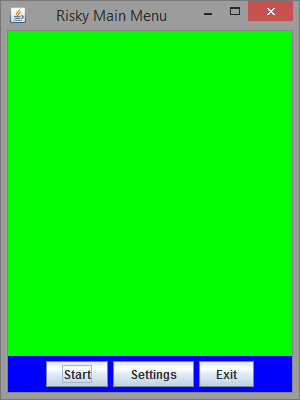
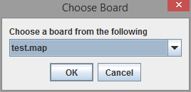
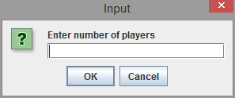
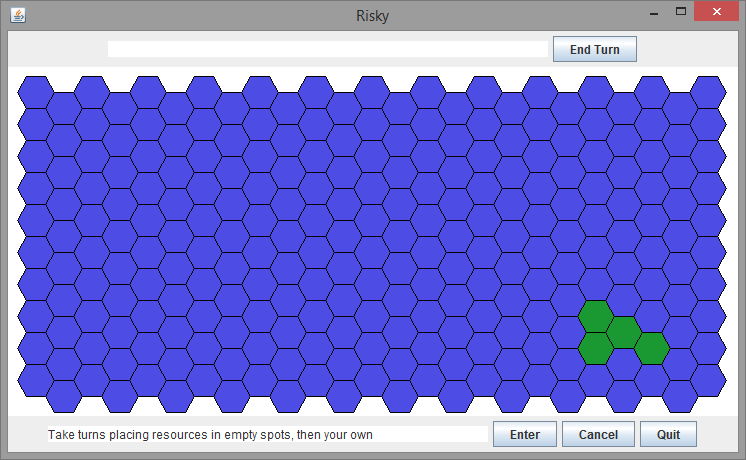
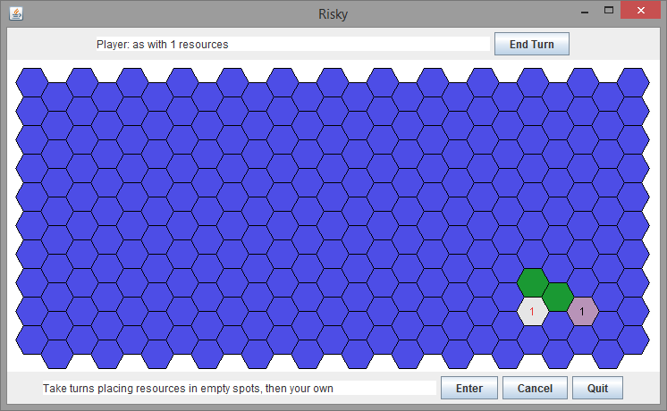
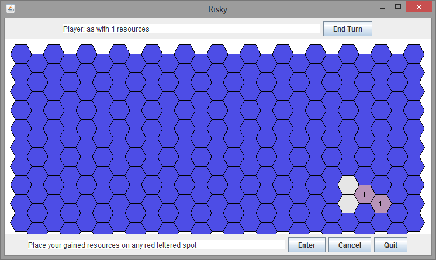
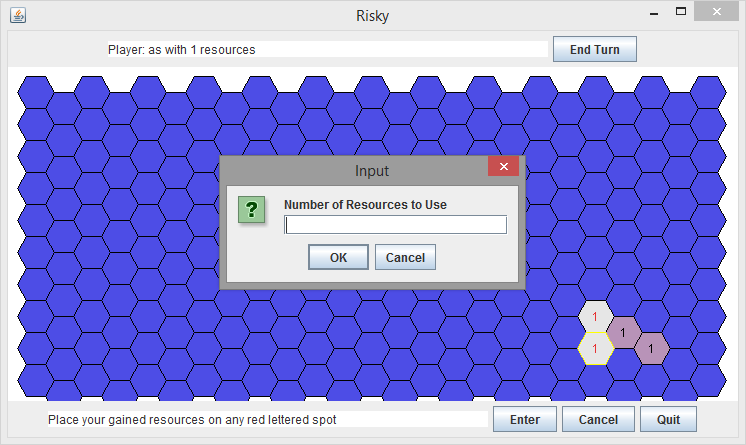
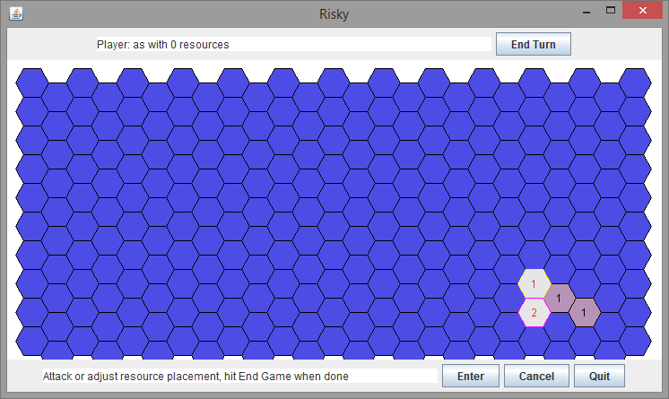
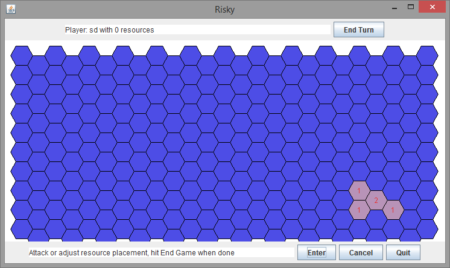
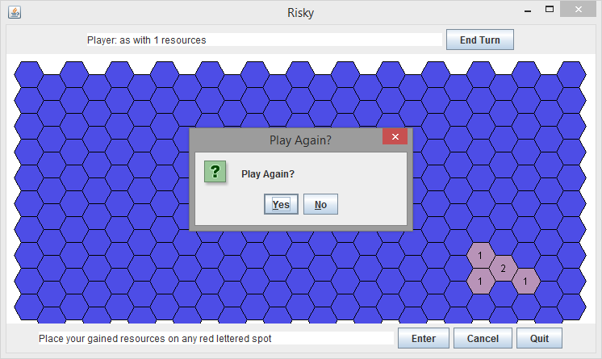

# Risky

An unofficial Risk-like game where players place Resources/Troops on spaces on a map, attempting to gain control of Countries in order to end up in control of the entire Map.

## How to Play

Start the game by running from src/risky.ui.menu.MenuGUI

Hit the start button to begin a new game

Pick a board from the dropdown and hit OK

Enter number of players, then player names

Choose any green space to claim spaces, bottom bar shows tooltip

Continue choosing empty green spaces, player shown in top bar

Hit enter to gain new resources as shown in bottom bar

Select any red lettered space for placement

Enter the number of resources, must be 1 <= x <= num resources at the top

Choose a source spot, and a final spot to move/attack resources. Attacking is random

After hitting Enter, turns change and red letters switch

Once all spots claimed, hit enter without selecting

Choose to play on same board or not

## Currently working

 * Player
    - basic information
    - can add spots, countries, and resources
 * Country
    - basic information
    - can claim country
    - checks for a player who owns all spaces in the country
 * Board
    - basic information
 * Spot
    - basic information
 * States
 	- basic state design pattern implemented
 * Risky
    - Holds the very simple game loop
    - Needs a lot of work
 * UI
    - Polygon map generation
    - Basic UI
    - Game loop integration

## TODOs

    Risky.java              |23 col 8| // TODO(david): remove this
    Risky.java              |37 col 7| //TODO(david): remove this
    Risky.java              |54 col 8| * TODO(david): remove this if unused
    Risky.java              |99 col 8| * TODO(david): generalize this to load a random board/player chosen board
    Risky.java              |100 col 8| * TODO(david): create spots that connect intercontinentally
    Risky.java              |107 col 12| // TODO(david): consolidate the board loops
    Risky.java              |109 col 16| // TODO(david): make more options
    Risky.java              |131 col 12| // TODO(david): clean this up a bit
    Risky.java              |165 col 8| * TODO(david): fix this to work with other gui
    Risky.java              |172 col 12| // TODO(david): make this dynamic?
    Risky.java              |231 col 12| // TODO(david); find a way to clean this out after tests
    Risky.java              |237 col 16| // TODO: determine how to connect disjointed countries
    Risky.java              |256 col 15| //TODO(david): add more cases to remove wrong input
    Risky.java              |271 col 16| // TODO: implement combat from UI
    Risky.java              |275 col 16| // TODO: implement resource management from UI
    Risky.java              |279 col 16| // TODO: test that winning works
    Risky.java              |374 col 8| * TODO(david): is this a duplicate function?
    Risky.java              |423 col 8| * TODO(david): see if this is really necessary
    common/Country.java     |15 col 8| * TODO: create country creator that specifies resources
    common/Player.java      |22 col 12| // TODO(david): set initial resources to be based on number of players
    common/Player.java      |85 col 8| * TODO: check if we need to keep track of this here
    common/Player.java      |94 col 8| * TODO: check if we need to keep track of this here
    common/Spot.java        |156 col 12| // TODO(david): fix this. currently assumes the coords are a spot on the board
    ui/BoardPanel.java      |162 col 8| * TODO: see if this can fully replace the above function
    ui/RiskyGUI.java        |37 col 12| // TODO(david): have board selection here?
    ui/RiskyGUI.java        |146 col 28| // TODO(david): end turn if not enough resources in spots
    ui/RiskyGUI.java        |167 col 16| // TODO(david): reset player's choices
    ui/RiskyGUI.java        |205 col 24| // TODO(david): limit resources properly in attack mode
    ui/menu/MenuGUI.java    |44 col 16| // TODO: settings menu
    
Future Aspects
--------------

 * Map generation via Perlin/Simplex Noise
 * All of those damn TODOs in Risky.java
